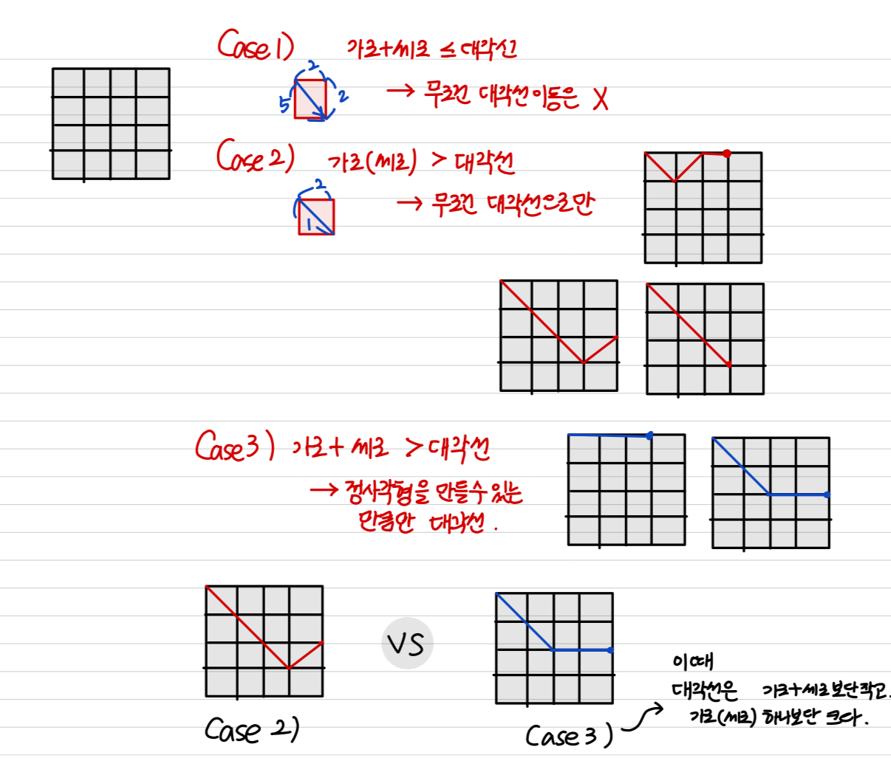

# [1459] 걷기

## 🔗 Problem Link  
https://www.acmicpc.net/problem/1459

## 💡 Approach  
- 좌표에 최소 시간으로 도달하는 방법 

## 🧾 Code  
```python
X, Y, A, B = map(int, input().split())
count = 0

if A * 2 <= B :
    count += A * (X + Y)
elif A > B : ### 대각선이 심하게 싼 경우 : 다 대각선으로 이동. 대각선으로 이동해도 한번의 수평/수직의 길이 남는 경우만 + A
    if (X + Y) % 2 == 0 :
        count += max(X, Y) * B
    else:
        count += (max(X, Y) - 1) * B + A

else:   ### 대각선이 2*a 보단 싸지만 a 하나보단 비쌀 때 : 최대한 대각선으로 가고 ( 정사각형 ) 그리고 수평/수직 이동 
    B_n = min(X, Y)  # 대각선으로 갈 거리 
    count += B_n * B

    A_n = max(X, Y) - B_n
    count += A_n * A 

print(count)
```

## 🎯 Key Point  
- elif 와 else의 분기문이 가장 중요함. 아래 예시를 보면 이해됨. 가로 + 세로 > 대각선 인 상황에서 (4, 2)를 어떻게 가는게 최선인가?

## 📚 What I Learned  
- 예제가 친절해서 케이스를 찾을 수 있었음. 예제 잘 확인하기. 