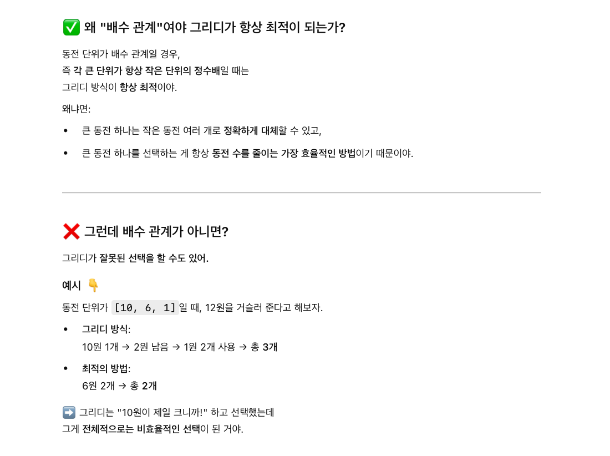

# [5585] 거스름돈

## 🔗 Problem Link  
https://www.acmicpc.net/problem/5585

## 💡 Approach  
- 최소 동전 개수 구하기 

## 🧾 Code  
```python
N = int(input())

account = 1000 - N
coins = [500, 100, 50, 10, 5, 1]
nums_coin = 0

for coin in coins:
    nums_coin += account // coin
    account %= coin

print(nums_coin)
```

## 🎯 Key Point  
- 그리디 알고리즘은 매 순간 가장 최선이라고 생각되는 선택을 하는 방식.
    - 매번 현재 남은 금액에서 가장 큰 단위의 동전을 먼저 사용한다.
    - 즉, "지금 상황에서 사용할 수 있는 가장 큰 단위의 동전을 선택한다. 
    - 이렇게 하면 매 단계에서 동전 개수를 최소화할 수 있는 선택을 하고 있는 셈이다.

> ➡️ 이 선택들이 쌓여서 결과적으로 **전체 동전의 개수**도 최소가 된다. 

## 📚 What I Learned  
